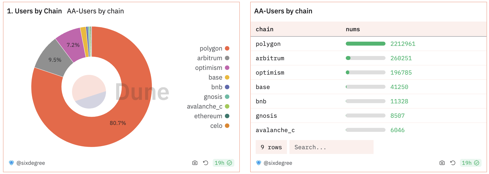
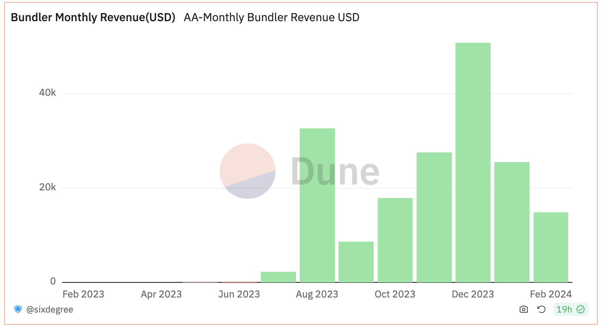
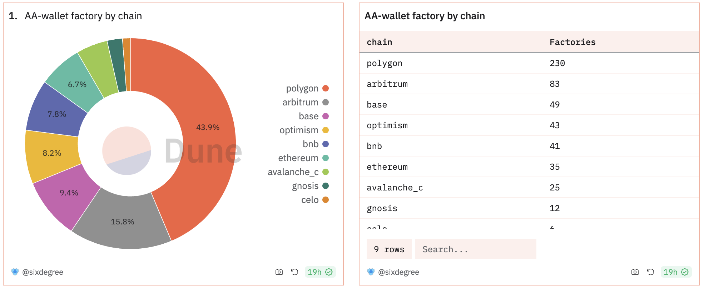

# AA Aggregation Table of EVM Chains

The `EntryPoint` contract of ERC4337 has been deployed on multiple EVM chains. You can view the list of all chains that have deployed the `EntryPoint` contract here:

- v0.5: https://blockscan.com/address/0x5fF137D4b0FDCD49DcA30c7CF57E578a026d2789
- v0.6: https://blockscan.com/address/0x0576a174D229E3cFA37253523E645A78A0C91B57

If you want to analyze the combined data of all EVM chains, it would clearly be too cumbersome to write the analysis one by one. Therefore, based on the spellbook of the dune platform, we have aggregated the data of the EntryPoint contracts of two versions on 9 major blockchains into two new data tables. These tables can currently be directly used on the dune platform for easy analysis. The specific source code can be found at:

https://github.com/duneanalytics/spellbook/tree/main/models/account_abstraction/erc4337


- `account_abstraction_erc4337.account_deployed`: Includes AccountDeployed event data from 9 chains
- `account_abstraction_erc4337.userops`: Contains `UserOperationEvent` event data from 9 chains, also joined with the `transactions` table and `price` table to get information like the bundler of each `userOp` and the gas fee paid for that transaction.

Including blockchains:
|           |        |
|-----------|--------|
| Ethereum  | Base   |
| Polygon   | BNB    |
| Arbitrum  | Celo   |
| Optimism  | Gnosis |
| Avalanche |        |


## account_abstraction_erc4337.userops

The aggregated table userops contains more information, the included field information is as follows:

| COLUMN              | DESCRIPTION                                                                                                                              |
|---------------------|------------------------------------------------------------------------------------------------------------------------------------------|
| blockchain          | blockchain which EntryPoint was deployed                                                                                                 |
| version             | version of the EntryPoint contract                                                                                                       |
| block_month         | UTC event block date of each User Operation                                                                                              |
| block_time          | UTC event block time of each User Operation                                                                                              |
| entrypoint_contract | the contract address of the EntryPoint                                                                                                   |
| tx_hash             | Unique transaction hash value tied to each transaction on the User Operation                                                             |
| sender              | the sender(AA wallet address) that submmited the user operation                                                                          |
| userop_hash         | Unique user operation hash                                                                                                               |
| success             | weather the user operation is successfully execuated                                                                                     |
| paymaster           | the address that pay for the user operation gas fees on behalf of the user                                                               |
| op_fee              | The gas paid by sender or paymaster It depends on the chain gas setting                                                                  |
| op_fee_usd          | The user operation gas (in usd) paid by sender or paymaster.                                                                             |
| bundler             | address that bundle UserOps and submit those UserOps to the final on-chain by send a EOA transaction. It is the transaction from address |
| tx_to               | address where the bundler send the transaction                                                                                           |
| gas_symbol          | the gas symbol paied for the transaction                                                                                                 |
| tx_fee              | the bundler paied gas value for the transaction                                                                                          |
| tx_fee_usd          | the bundler paied gas (in usd) value for the transaction                                                                                 |
| beneficiary         | the address where the bundler setting for the user operation pay for thier gas fee                                                       |


The analysis will then be much simpler. For example, analyzing the distribution of `user operations` across 9 chains:

```sql
with total_op as (
    select blockchain as chain, * from account_abstraction_erc4337.userops 
)
select chain, count(*) as nums from total_op group by chain order by nums desc
```



For another example, analyzing the monthly profit of bundlers:

```sql
with agg_ops as (
    select 
      row_number() over (partition by tx_hash order by userop_hash) as rn
    , sum(op_fee) over(PARTITION by tx_hash) as op_fee
    , sum(op_fee_usd) over(PARTITION by tx_hash) as op_fee_usd
    , tx_fee
    , tx_fee_usd
    , blockchain as chain
    , gas_symbol as symbol
    , block_time
    from account_abstraction_erc4337.userops 
)
, revenue as (
    select
        date_trunc('month', block_time) as dt
        , sum(op_fee_usd - tx_fee_usd) as BundlerRevenueUSD
    from agg_ops
    where rn = 1
    group by 1
)
select  dt, 
    sum(BundlerRevenueUSD) as TotalBundlerRevenueUSD,
    case 
        when sum(BundlerRevenueUSD)>=0 then 'Positive'
        when sum(BundlerRevenueUSD)<0 then 'Negative'
    end as PosNeg
        
from revenue group by 1

```



## account_abstraction_erc4337.account_deployed

The information contained in account_deployed is relatively small, it just integrates the data of the two contract versions and several EVM chains together. 
See the link for detailed definitions:

https://spellbook-docs.dune.com/#!/model/model.spellbook.account_abstraction_erc4337_account_deployed

The fields included in the aggregated account_deployed table are as follows:

| COLUMN              | DESCRIPTION                                                                  |
|---------------------|------------------------------------------------------------------------------|
| blockchain          | blockchain which EntryPoint was deployed                                     |
| version             | version of the EntryPoint contract                                           |
| block_time          | UTC event block time of each User Operation                                  |
| block_month         | UTC event block date of each User Operation                                  |
| userop_hash         | Unique user operation hash                                                   |
| entrypoint_contract | the contract address of the EntryPoint                                       |
| tx_hash             | Unique transaction hash value tied to each transaction on the User Operation |
| sender              | the sender(AA wallet address) that submmited the user operation              |
| paymaster           | the address that pay for the user operation gas fees on behalf of the user   |
| factory             | who can create a new AA Wallet. It's smart contract address                  


Using `account_deployed` aggregated tables makes analysis simpler as well. For example, getting the number of wallet factories on each chain:

``` sql
with total_op as (
    select blockchain as chain, * from account_abstraction_erc4337.account_deployed
)
select chain, count(distinct factory) as Factories from total_op group by 1 order by 2 desc
```



For complete examples, please refer to the following link. This dashboard contains analyses of various aspects of `EntryPoint`:

https://dune.com/sixdegree/account-abstraction-overview
